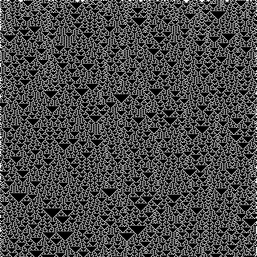

# elementary-ca

Python script to generate images of [elementary cellular automata](http://en.wikipedia.org/wiki/Elementary_cellular_automaton).

The first row along with the left and right edges are seeded randomly.

Example:

## Command line arguments

* `-x` : Sets the width of the output. (default: 322px)
* `-y` : Sets the height of the output. (default: 322px)
* `-r` : Sets the rule number. See [Wolfram MathWorld](http://mathworld.wolfram.com/ElementaryCellularAutomaton.html) for details.
* `-o` : Sets the name of the output file. "out.png" by default.
* `-s` : Scales the output by an integer factor. 1 by default.